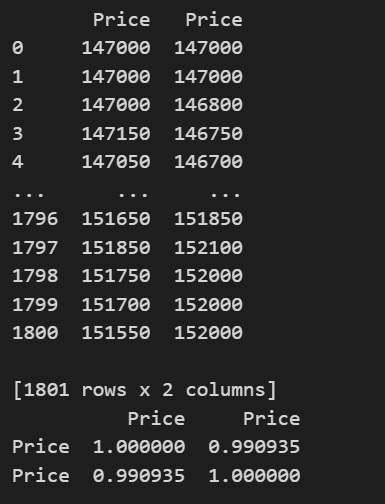

# Log 1 - A poor start
  
  | Date | Branch | Commit |
  |----------- | ----------- | ----------- |
  | 12/03/2023 | Main | 53538b5 |


Research and data analysis have been our main focus the last few days, so much so that we have not had anytime to do anything practical. Thus missed our first deadline yesterday. Luckily, nothing counts until the final deadline next week, so we can start to implement the things we have learnt. And have we learnt a lot!

## Research
First, using the information given to us by Optiver, we realised that we were going to have to use a trading strategy called 'pairs trading'. 

A pairs trading stategy involves trading two financial instruments that are highly correlated with each other in order to profit from their relative price. In this case, the highly related ETF and corresponding future contracts.

After extensive research, the most helpful sources of information was: 

An overview on CMC markets: https://www.cmcmarkets.com/en-gb/trading-guides/pairs-trading

But for a more practical resource, was surprisngly twitter. Where you would find many data scientists giving out their secrets. A lot of what we will use is credited to this specific feed: https://twitter.com/pyquantnews/status/1605915613343453187?s=49&t=9Qvg_zzy-rK31R0OL9Qn_g


## Data Analysis
### Correlation

What traders will do to start with is actually start by choosing the two intruments that are highly correlated. Even though the two instruments are given to us, there is no harm in checking their correlation. 

First I calculated midpoint prices between the two intruments using the python package numpy, to get an accurate picture of what the market prices would look like. Then used this to see how similar the intruments are. 

```python

# Read market data 1
market_data1 = pd.read_csv("midpoint_log.txt")

market_data1.columns = ['Instrument', 'Price']

# Split dataframe into seperate instruments
instrument0_midpoint_price = market_data1[market_data1['Instrument'] == 0]
instrument1_midpoint_price = market_data1[market_data1['Instrument'] == 1] 

instrument0_midpoint_price = instrument0_midpoint_price.reset_index()
instrument0_midpoint_price = instrument0_midpoint_price['Price'][:-1]

instrument1_midpoint_price = instrument1_midpoint_price.reset_index()
instrument1_midpoint_price = instrument1_midpoint_price['Price']

prices = pd.concat([instrument0_midpoint_price, instrument1_midpoint_price], axis=1)
print(prices)

print(prices.corr())

```

Here are the results:




