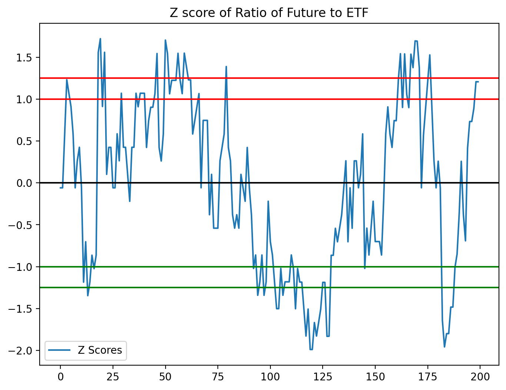
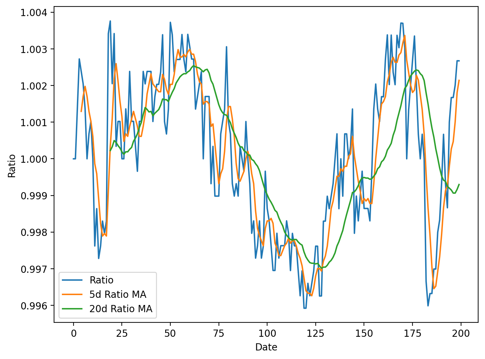
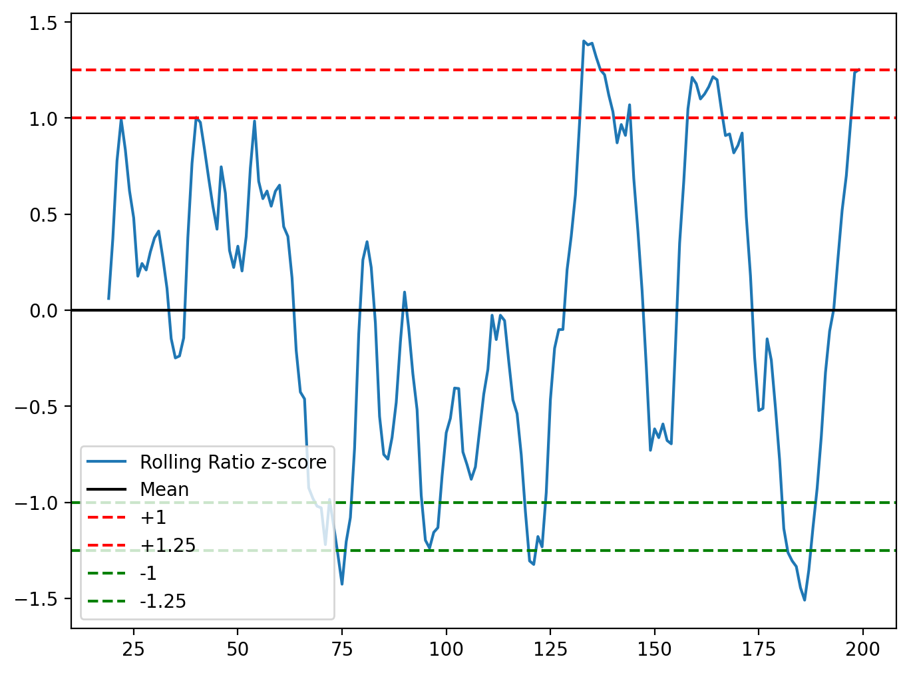

# Log 1 - A poor start
  
  | Date | Branch | Commit |
  |----------- | ----------- | ----------- |
  | 12/03/2023 | Main | 53538b5 |


Research and data analysis have been our main focus the last few days, so much so that we have not had anytime to do anything practical. Thus missed our first deadline yesterday. Luckily, nothing counts until the final deadline next week, so we can start to implement the things we have learnt. And have we learnt a lot!

---

## Research
First, using the information given to us by Optiver, we realised that we were going to have to use a trading strategy called 'pairs trading'. 

A pairs trading stategy involves trading two financial instruments that are highly correlated with each other in order to profit from their relative price. In this case, the highly related ETF and corresponding future contracts.

After extensive research, the most helpful sources of information was: 

An overview on CMC markets: https://www.cmcmarkets.com/en-gb/trading-guides/pairs-trading

But for a more practical resource, was surprisingly, twitter. Where you would find many data scientists giving out their secrets. A lot of what we will use is credited to this specific feed: https://twitter.com/pyquantnews/status/1605915613343453187?s=49&t=9Qvg_zzy-rK31R0OL9Qn_g


## Data Analysis
### Correlation

What traders will do to start with is actually start by choosing the two intruments that are highly correlated. Even though the two instruments are given to us, there is no harm in checking their correlation. 

First I calculated midpoint prices between the two intruments using the python package numpy, to get an accurate picture of what the market prices would look like. Then used this to see how similar the intruments are. 

```python

# Read market data 1
market_data1 = pd.read_csv("midpoint_log.txt")

market_data1.columns = ['Instrument', 'Price']

# Split dataframe into seperate instruments
instrument0_midpoint_price = market_data1[market_data1['Instrument'] == 0]
instrument1_midpoint_price = market_data1[market_data1['Instrument'] == 1] 

instrument0_midpoint_price = instrument0_midpoint_price.reset_index()
instrument0_midpoint_price = instrument0_midpoint_price['Price'][:-1]

instrument1_midpoint_price = instrument1_midpoint_price.reset_index()
instrument1_midpoint_price = instrument1_midpoint_price['Price']

prices = pd.concat([instrument0_midpoint_price, instrument1_midpoint_price], axis=1)
print(prices)

print(prices.corr())

```

Here are the results:


### Z-score

When looking on public forums such as forexfactory.com and also looking at that twitter page referenced above, it is clear that **Z-score** will be a big player in tracking the movement of how these financial intruments move.

The Z-score, commonly referred to as the standard score, is a statistical indicator that shows how many standard deviations a data point deviates from the population mean. When calculating the Z-score, the population mean is subtracted from each data point, and the result is divided by the population standard deviation:

Z = (X - μ) / σ

where:

- Z is the Z-score
- X is the value of the data point
- μ is the population mean
- σ is the population standard deviation

To find trading chances in pair trading, Z-score is frequently used. 

The spread's Z-score shows how far out in terms of standard deviations it is from its historical mean. If the spread is trading above its historical average and the Z-score is positive, the trader may sell the relatively expensive asset and purchase the relatively inexpensive one. If the Z-score is negative, on the other hand, it indicates that the spread is trading below its historical mean, and the trader may choose to buy the relatively inexpensive asset and sell the relatively expensive one.

So using numpy, and the first market data set used above, we can calculate the z scores using the mean of the ratio of ETF to Future contracts.

```python
#only using the first 200 data points
FuturePrices = instrument0_midpoint_price[:200]
ETFPrices = instrument1_midpoint_price[:200]

ratio = FuturePrices / ETFPrices

df_zscore = (ratio - ratio.mean())/ratio.std()

```

Through some boundy lines in there, plot it, and you get: 



### Moving averages
A moving average is a calculation of the average price of an asset over a specified period of time, which is updated as each new data point is added.

Based on their trading technique and the time frame of their study, traders can determine the moving average's period length. A trader who uses daily charts, for instance, would employ a 50-day or 200-day moving average to spot longer-term trends.

Moving averages are used instead of standard averages because they offer a more precise and current picture of an asset's price movement over time. Moving averages can be used to generate trading signals and help reduce the impact of noise or brief swings in an asset's price.

Using numpy package, we can show this on a graph:

```python
ratios_mavg5 = ratio.rolling(window=5, center=False).mean()
ratios_mavg20 = ratio.rolling(window=20, center=False).mean()
std_20 = ratio.rolling(window=20, center=False).std()
zscore_20_5 = (ratios_mavg5 - ratios_mavg20)/std_20


```



Then if we look at the z score graph...



We can see from this graph, the rolling Z-score graph looks a lot smoother and less eratic, hence we can be more consistent with our trades in the future if we implement moving averages. 

---

## Conclusion
It's clear that the two financial instruments that we are trading move very similarly, hence we can measure their spread from one another and treat it as a magenet to each other, always returning to some average and never deviating.

We should use the spread of data from the two financial intruments and set indication z-values of +1 and -1, and see whether this gives us an effective profit, or even if we break even.

If this does not work, we will research into other methods.


## Next Steps

- Figure out how to effectively buy and sell in the market
- Use the z-score to get buy and sell signals
- Optimise this by getting moving averages involved


### Resources used: 
https://www.forexfactory.com/
