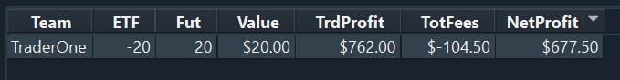

# Log 2 - A new beginning

  | Date | Branch | Commit |
  |----------- | ----------- | ----------- |
  | 21/04/2023 | spread_development | f25cc91 |

You'll notice that it has been more than a month since the last log. This is because the code we were given for this project was much more complicated than we had anticipated. It took us a lot longer to understand the code and figure out how to implement the changes we needed.

It was odd how they set out the code, most of it was simply an aid for the simulation, and it was difficult to understand how the actual autotrader would communicate with the orderbooks and gather information for it. Even when we were sending orders, they simply would never file. 

Therefore, we had no credible algorithm to hand in to Optiver on the final date submission. Adam and I both agreed that this project would be more beneficial to take our time and get a good grasp with how to implement a successful algorithm; no point rushing around and just giving in something that does not actually communicate what we know.

But now we have a very good grasp on the code, and can implement all the things which we want to implement in the code. 

I'm glad we took the time to do things right, even if it did take longer than we expected. Now we're back on track and making good progress towards our goals.

---

## How the code works

- The code is written so that the autotrader is completely seperate from the simulation.

- It's classed based system; some classes for the autotrader, some for the simulation. Everything runs independantly (just like it would be in an actual market)

- Every class is updated when the program 'ticks'( a simulated amount of time); the simulation sends information to the autotrader, mostly via the order book (every single order being sent to the simulated market) and then based on each order, our auto trader needs to do something

Here is the auto trader class: 

``` python

class AutoTrader(BaseAutoTrader):
    def __init__(self, loop: asyncio.AbstractEventLoop, team_name: str, secret: str):
        """Initialise a new instance of the AutoTrader class."""
        super().__init__(loop, team_name, secret)
        self.order_ids = itertools.count(1)
        self.bids = set()
        self.asks = set()
        self.ask_id = self.ask_price = self.bid_id = self.bid_price = self.position = 0

        #...

    def on_error_message(self, client_order_id: int, error_message: bytes) -> None:
        """Called when the exchange detects an error."""
        #...
    def on_hedge_filled_message(self, client_order_id: int, price: int, volume: int) -> None:
        """Called when one of your hedge orders is filled."""
        #...

    def on_order_book_update_message(self, instrument: int, sequence_number: int, ask_prices: List[int],
                                     ask_volumes: List[int], bid_prices: List[int], bid_volumes: List[int]) -> None:
        """Called periodically to report the status of an order book."""
        #...

    def on_order_filled_message(self, client_order_id: int, price: int, volume: int) -> None:
        """Called when one of your orders is filled, partially or fully."""
          #...

    def on_order_status_message(self, client_order_id: int, fill_volume: int, remaining_volume: int,
                                fees: int) -> None:
        """Called when the status of one of your orders changes."""
    #...

    def on_trade_ticks_message(self, instrument: int, sequence_number: int, ask_prices: List[int],
                               ask_volumes: List[int], bid_prices: List[int], bid_volumes: List[int]) -> None:
        """Called periodically when there is trading activity on the market."""
    #...

```

They key point to take away from the code is that information from the market comes directly from the class variables themselves. Order ids, current ask/bid prices, volumes, intrument types etc, all get updated within your class. 

The class procedure which handles this data is mainly in the 
```python
def on_order_book_update_message(...)
```

The orders will look something like this:

```
Time,Instrument,Operation,OrderId,Side,Volume,Price,Lifespan
...
435.897216,0,Insert,190746375,A,1000,1494,G
435.897228,0,Insert,190746379,A,1000,1494,G
435.89726,0,Cancel,190745707,,,,G
435.897265,0,Insert,190746391,A,8000,1494,G
435.923862,0,Cancel,190746379,,,,G
435.934505,1,Insert,190746983,A,400,1494,G
435.95596,0,Insert,190747727,B,8000,1492,G
...
```
- **Time:** the ticks in the system you can see that for the one tick (435) there are over 1000 orders being filled
- **Instrument:** if its the ETF or Future contracts.
- **Operation:** is if we're inserting an order or cancelling it
- **OrderId:** The id of the this order
- **Side:** whether its an ask or bid order
- **Volume, Price**
- **Lifespan:** Whether its good for the day (won't go away), or if its a fill and kill (will cancel if it doesnt file immediately)

### Hedging
Hedging refers to taking a position in one asset to offset the risk of a position in another asset. Since pair trading involves buying and selling two related assets simultaneously, we need to implement hedging.

Luckily the algorithm, does this automatically:

``` python
    def on_order_filled_message(...) -> None
        if client_order_id in self.bids:
            self.position += volume
            self.send_hedge_order(next(self.order_ids), Side.ASK, MIN_BID_NEAREST_TICK, volume)
        elif client_order_id in self.asks:
            self.position -= volume
            self.send_hedge_order(next(self.order_ids), Side.BID, MAX_ASK_NEAREST_TICK, volume)
```
---

## Log Goal

- Read the order book data effectively
- Implement our strategy from Log 1
---

## Implementation

In order to implement our strategy we needed to calculate some key informations each tick:
- Midpoint prices between ask and bid prices (the market equilibrium)
- The ratio between the two market equilibriums
- Calculate the moving average of the ratios
- The z score each tick

### Midpoints and ratio
To calculate midpoint prices and ratio I did: 

``` python
# Generate midpoint price
self.midpoint_price = pd.Series((bid_prices[0] + ask_prices[0]) / 200.0)

# Add midpoint to the instrument price Series
if instrument == 0:
    self.future_price = pd.concat([self.future_price, self.midpoint_price], ignore_index=True)
else:
    self.etf_price = pd.concat([self.etf_price, self.midpoint_price], ignore_index=True)


# Find the price ratio of the Future and ETF price
# we want it to do it as a new ratio to add to a list
# if we calculate the full list everytime it will not be as effecient
newratio = pd.Series(self.future_price.iloc[-1]/self.etf_price.iloc[-1])
self.ratio = pd.concat([self.ratio,newratio], ignore_index=True)
```

I chose to use panda series, whilst my partner used normal lists, due to the fact that I though it would be easier to reference things since panda series' indexing is more effecient. 

I also made the code more effecient by adding a new point of ratio each time, rather than re calculating the ratio of the full list of midpoint prices (like it was done before this commit)


### Moving Averages

- I chose average windows of 5 and 20. This means that the zscore would update every 5 ratios. 
- Added a feature that allows the code to get rid of any silly values like infinity and NaN
- Chose to recalculate the standard deviations on a long term basis, matched with the 20 window

``` python
# ratios_mavag5 will be recalculated every 5 orders
if self.ratio.size % 5 == 0:
        #grab last five ratios
        last_five = self.ratio.iloc[-5:]
        #convert inf values to NaN
        last_five = last_five.replace([np.inf, -np.inf], np.nan)
        # Remove NaN values
        last_five = last_five.dropna()
        #calculate the mean of the last five values    
        self.ratios_mavg5 = last_five.mean()
        
# ratios_mavag20 and standard deviation will be recalculated every 20 orders.
if self.ratio.size % 20 == 0:
        #grab the last twenty ratios
        last_twen = self.ratio.iloc[-20:]
        #convert inf values to NaN
        last_twen = last_twen.replace([np.inf, -np.inf], np.nan)
        # Remove NaN values
        last_twen = last_twen.dropna()

        #calculate the mean of the last twenty values    
        self.ratios_mavg20 = last_twen.mean()
        #calculate the standard deviation of the last twenty values
        self.ratios_std20 = last_twen.std() 

#calculate z score and add it to our panda series
newZscore = pd.Series((self.ratios_mavg5 - self.ratios_mavg20) / self.ratios_std20)
self.zscore_20_5 = pd.concat([self.zscore_20_5,newZscore], ignore_index=True)
```

### Buying and Selling 

Then once I had the moving averages working, my partner had the orders working on the main branch, so I could then implement that on this branch. 

Our signals look like this: 
``` python
if self.zscore_20_5.iloc[-1] < -1:
    self.current_signal = "Buy"
elif self.zscore_20_5.iloc[-1] > 1:
    self.current_signal = "Sell"
```

My partner's solution was then to alternate between buy and sell to mitagate as much risk as possible, and also the volume of the orders are kept at a constant base lot of 10.

## Results



It was very rewarding seeing that our first run of the implementation we wanted is already so profitable

## Next Steps
1. Review what moving average pairs are most optimal (5 and 20 may not be)
2. Review what Z-score is the most optimal
3. Look at a way of manipulating volume for better results.


