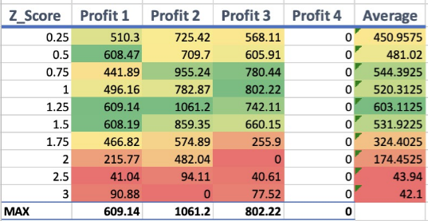
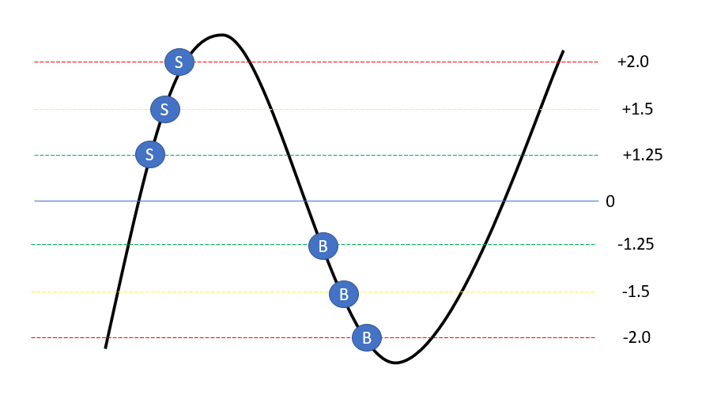
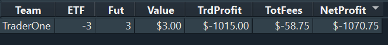
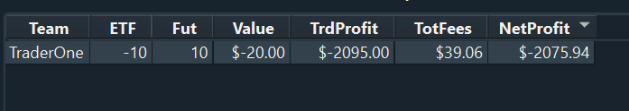

# Log 4 - Volume

  | Date | Branch | Commit |
  |----------- | ----------- | ----------- |
  | 27/04/2023 | volume_development | e3a888a |


---
## Algorithm update:
My partner has been tasked with comparing z-scores and has found that the optimal z-score indicator is now |1.25| as you can see in the following table.




Creating a new branch 'volume_development' which has this 

Whilst he compares the most effective moving average pairs, I will try to implement some kind of volume adjustment. 

--- 

## Log Goal:
To optimise this algorithm by adjusting volume of trades

--- 

## Research:

When Adam and I first even mentioned optimisation, it was clear that volume was going to be a big factor in maximising our profit.

Here are 3 different ways that we found volume can be manipulated in order to achieve our goals:

1. **Buy the full amount of available volume:** If indicators show that the current market price is signalling a buy or sell, why not just order the full amount that is available. If our algorithm is solid and profitable, buying/selling the full amount should only lead to best possible outcome of that signal. (but of course it's not that simple)

2. **Set a fixed trade size:** This is our current strategy. Setting a fixed trade size for each trade is one way to control the volume. For instance, you might decide to execute a pair trade with 100 shares of each stock. This strategy will guarantee consistency in your trades and make it simple for you to monitor your progress over time.

3. **Adjust trade size based on probability of movement:** Another strategy is to modify your trade size in accordance with the z-score. You would create proportionality between the z-score and the volume of trade. i.e., the (modularly) higher the z-score the greater volume we buy since there is a greater probability that the market will move in our favour; a 'stronger signal' if you will. 

So, since our lot limit is 100. That rules out buying the full availble volume since some trades go up to 10000 lots. So we will try to get a trade size proportional to the probability of movement instead. 

---

## Design
The solution to adjusting trade size based on z-score comes down to two main decisions. 

1. What type of proportionality it is. i.e. is it directly propositional with some constant (c). Or will it be exponentially proportional to some power constant (c)
2. The magnitude of that constant (c)

So, the plan would be to create an implementation of both proportions, and see what different magnitudes produce the most profitable solutions. 

### Direct Proportion
```python
  INPUT: a z_score indicating some kind of signal, constant C, availableVolume 
  OUTPUT: the volume of which we buy

  #mod z-score, we only care about its maginitude of strength
  z_score = |z_score|
  #multiply by our constant
  k = z_score*C

  if k >= 1:
    #definitaly need to buy full amount
    #maybe even implement the idea of buying away from market price because the volume is simply not enough
    VolumetoBuy = availbleVolume
  else:
    VolumetoBuy = availableVolume * k

  return (VolumetoBuy)
```
### Exponential Proportion
```python
  INPUT: a z_score indicating some kind of signal, constant C, availableVolume 
  OUTPUT: the volume of which we buy


  z_score = |z_score|
  #power by our constant, as long as our constant is less than 1 this works.
  k = z_score**C

  if k >= 1:
    VolumetoBuy = availbleVolume
  else:
    VolumetoBuy = availableVolume * k

  return (VolumetoBuy)
```

---

## Implementation

Before implementing the change in volumes a few issues came to mind:
1. We have an active volume limit of 100, so having too many high lot trades will exceed that limit.
2. Our current solution buys and sells as soon as it hits our z-score indication. Meaning the algorithm does not give it a chance to get to our extremer (stronger) values of z.
3. Our current solution alternates between buying and selling signals.

Therefore, I had to change the design as well as the way that we buy and sell positions.

The idea is that when the zscore breaks through our indication value and creates a trough, there are only a maximum of three orders put in at any one troph-time: 



Since the auto-trader automatically hedges values for us, it is rather unlickly that our position would exceed the lot limit and a given time, since it allows the buying and selling to cancel out (as long as the base lot size is not very high)

So to implement this, I created a dictionary of data signals. To track what we have ordered on each troph:

```python
#see what troph we are located in
if self.zscore < 0 and self.SellingTroph == True:
  self.BuyingTroph = True
  self.SellingTroph = False
  #if we have entered the buying troph, we can make sell trades again
  self.ActiveOrders.update({"StrongSell":False})
  self.ActiveOrders.update({"MediumSell":False})
  self.ActiveOrders.update({"LowSell":False})

elif self.zscore > 0 and self.BuyingTroph == True:
  self.SellingTroph = True
  self.BuyingTroph = False
  #if we have entered the selling troph, we can make buy trades again
  self.ActiveOrders.update({"StrongBuy":False})
  self.ActiveOrders.update({"MediumBuy":False})
  self.ActiveOrders.update({"LowBuy":False})
```

Then we figure out how much volume we buy and sell at each signal:
```python

#the direct constant will be found by saying that the base lot-size will be traded at the lowest indicator
K=LOT_SIZE/WEAK_INDICATOR
if abs(self.zscore) >= STRONG_INDICATOR:
  signal_strength = STRONG_INDICATOR
  VolumeToBuy = K*STRONG_INDICATOR
elif abs(self.zscore) >= MEDIUM_INDICATOR:
  signal_strength = MEDIUM_INDICATOR
  VolumeToBuy = K*MEDIUM_INDICATOR
else:
  signal_strength = WEAK_INDICATOR
  VolumeToBuy = K*WEAK_INDICATOR

VolumeToBuy = int(VolumeToBuy)
```

I made the direct proportion constant in such a way that the Base LOT_SIZE is bought at the weakest indicator. Then proportionally goes up as the indicator gets stronger

Then we make it so it only can do each type of these trades once every troph:


---
## Results

Horrible.

 

At first, I thought it was due to a position limit. but even when changing the lot sizes to the most minimal numbers, this still did not allow the trades to go off as required. In the end, the issue is due to the type of orders being sent on the order book. The auto-trading platform offers the following type of orders.

1. Fill and Kill - orders trade immediately, if possible, otherwise they are cancelled
2. Good-For-Day - Good for day orders remain in the market until they trade or are explicitly cancelled

And our orders are fill and kill. Meaning the price points change by the time all the computation is done, thus the orders get cancelled if the price fluctuates too much (since there is no immediate demand)

So, I simply tried to switch to good-for-day orders to allow the orders to... marinate...



And of course, this is much worse since when we sell, we would be offering a consumer benefit price compared to the market. Similarly, when buying, we would be accepting at a producer benefit price (i.e just losing out on both ends)

So it is not as simple as switching. 

## Next Steps

I refuse to end on such a large negative (literally). 

Therefore I will do an additional log where I will go back to our original autotrader and try to implement volume adjucment but more in line with the original buying and selling strategy; where I think the careful implementation of alternating buy and sell signals is actually very advantagous for a profitibale strategy. 


### Resources used: 
https://www.forexfactory.com/