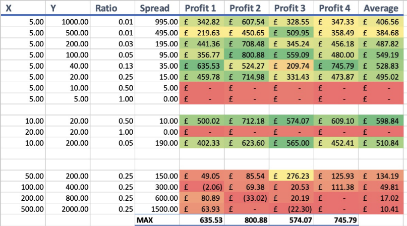
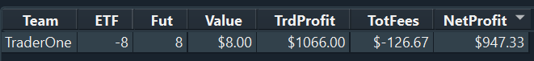
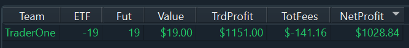
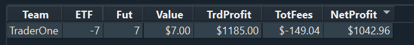
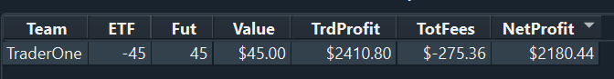
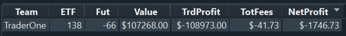
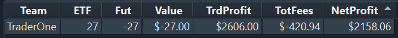
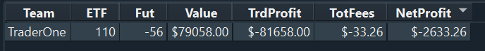

# Log 5 - Volume Continued

## Algorithm Update
No updates to the algorithm code itself.

My partner did gather some intelligence concerning the optimal pair of moving averages. Here are the results: 



We found that the sweet spot between the short term moving average and the long term moving average is one where they sit at a ratio of 0.05 to one another. And we want the moving average to really show what the market is telling us, so we want to keep the short term as short as possible (without losing its effectiveness), so a moving average of 5 and 100 seemed to be the best choice moving forward. So hopefully I can get that to work with the volume solution.

This is the current results of having a constant lot size of 10 being bought at an indicator of 1.25



---

## Log Goal
1. To implement a more simplistic volume adjustment on the original algorithm. Minimise computation as much as possible. 

2. Implement the moving averages

---

## Design

Throughout the debugging process of the previous volume solution, I noticed that the z-score was actually very jumpy. It does not gradually change from one value to another (since the market is so volatile). So when we do notice that the signal strength is high, we should act on it straight away, rather than waiting around to see if it will go higher, or lower.

---

## Implementation

As previously done, when the z score is taken in, we see how strong the signal is.

``` python

#see the volume based on z score
K=BASE_LOT_SIZE/LOW_INDICATOR
if abs(self.zscore) >= STRONG_INDICATOR:
    VolumeToOrder = K*STRONG_INDICATOR
elif abs(self.zscore) >= MEDIUM_INDICATOR:
    VolumeToOrder = K*MEDIUM_INDICATOR
elif abs(self.zscore) >= LOW_INDICATOR:
    VolumeToOrder = K*LOW_INDICATOR

VolumeToOrder = int(VolumeToOrder)

```

And then using the original code, I would alternate between buy and sell signals where the volume changes each time.

I also need to choose how I manage the price adjustment for each ask price and buy price. It makes sense to me to only adjust relative to the base lot since that is the lot I am trying to multiply:

``` python


```

I'll then see if setting the price adjustment relative to every volume change will work after this. 

---
## Results - Using Market_Data_2

With the first implementation of having the base lot of 10 and having the price adjusted only to the base lot



Now lets see what happens if we change the price compared to each individual lot volume we buy. But keep base lot to 10



Now lets see what happens if we pump up that base lot to 20.



Finally, some excitement! What a huge success

Then we change the base lot to 40 and see what happens



What happened here is that we reached the lot limit way to quickly at the start so it was not profitable. Also, as it stands 40 is way to high, for strong signals it we were buying lot sizes of up to 80 and 100. So it is not efficient. 

Lets try and change the volume to buy code a little bit.

## Implementation 2

``` python

#see the volume based on z score
K=10
if abs(self.zscore) >= STRONG_INDICATOR:
    VolumeToOrder = BASE_LOT_SIZE + 2*K
elif abs(self.zscore) >= MEDIUM_INDICATOR:
    VolumeToOrder = BASE_LOT_SIZE + K
elif abs(self.zscore) >= LOW_INDICATOR:
    VolumeToOrder = BASE_LOT_SIZE

VolumeToOrder = int(VolumeToOrder)

```

## Result 2

This is the result



I think if we go back to the original solution and use a base lot of 30. So we can really use the z-score effectively, since I think this is the best way to bullet proof values. 

Unfortuntely, the results are not the best. 



In the end, the set up that produced the best result was one with base lot of 20.


## Implementation 3

Now lets implement a moving average to our solution, to hopefully get a concrete, profitible solution. 


---

## Next Steps

Though this is my final log, I will continue to play around and hopefully implement something I can use on actual markets. 

For next steps I believe I need to knuckle down on really understanding markets, and how I can manipulate them. 

Looking back, I have been looking at my logs at a data-science angle. When actually, most of the issues I encountered was figuring out how orders in the market worked. 

So I need to research more thoroughly, how making orders on a market actually works. Then I can look at making 