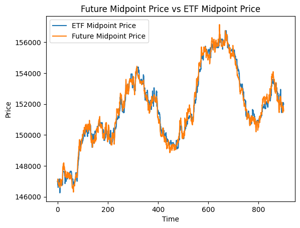
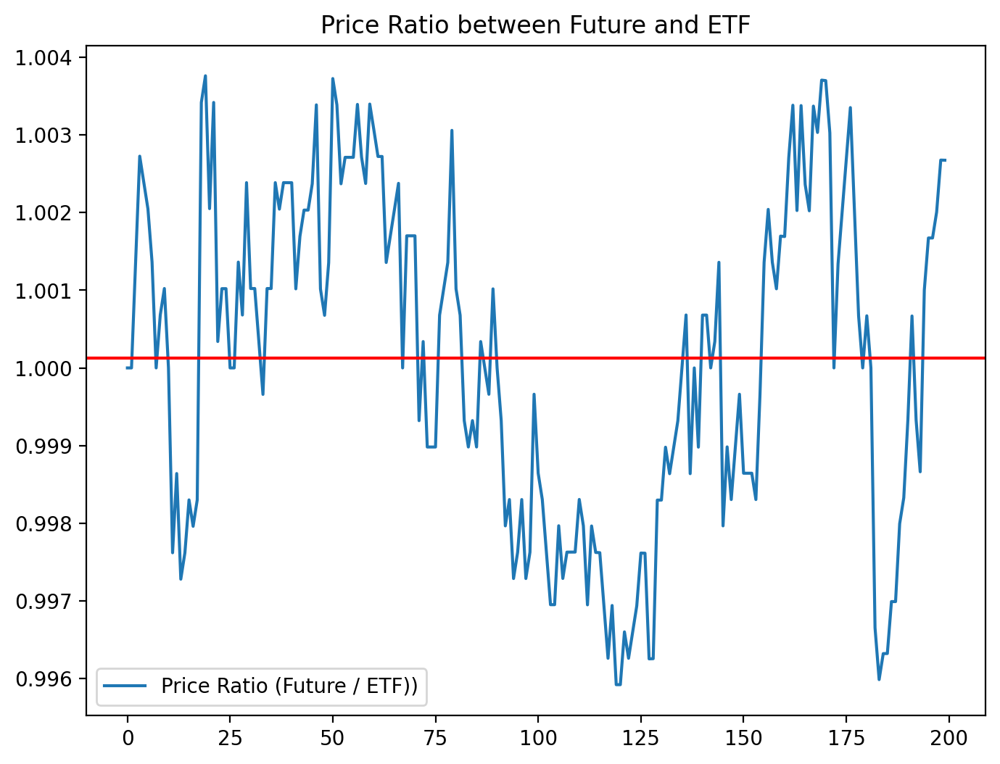

# Pair trading - How to get a profitable solution

Do you want a trading strategy which is very low risk and high rewards? 

Who doesn't! 

Pairs trading is a method of trading the economic connection between two equities. More specifically, two equities that move almost identically, with almost identical prices. 

For example, you might have two companies with the same supply chain, which will be impacted by the same economic forces.

Another example, is the correlation between ETFs (Exchange-Traded Funds) and futures contracts. When you buy an ETF, you are essentially buying a basket of securities that represents a specific sector or market. Often ETFs invest in future contracts (agreements to buy or sell an underlying asset at a predetermined price and date in the future.) Like, an oil ETF may hold futures contracts for crude oil. In this way, ETFs and futures can be indirectly related.

Here is the step-by-step process using python:

1. Get your data
2. Check correlation to find a pair
3. Model the spread
4. Trade your strategy

## Packages

We will be using python for this so make sure to import the following packages in order to do the data analysis:

``` python
import pandas as pa
import numpy as np
import matplotlib.pyplot as plt
from matplotlib.pyplot import figure
```
## 1. Get your data
I recommend doing the data analysis in a jupyter notebook as this is easier to run multiple blocks of data analysis so to compare later on.

Depending if you're using a simulated market or histroical data, you may be able to skip some of this since different types of data are available to different simulated markets. 

What you are looking to do is get the midpoint price from each of your financial instruments; every market where a product or financial instrument is being sold, there are orders to buy the product, and there are orders to sell. The midpoint price, also known as the equilibrium price, is where these meet; where the asking prices and bidding prices meet, so that it reflects how much this product 'costs' at one time. 

This information can be extracted from most trading platforms, for example on https://www.tradingview.com/

Once you have this data in some form of an array or series: 

```
...
0,147000
1,147000
0,147000
0,147200
1,146700
...
```

In this case, the 0 and 1 in front of each price in cents represents two different financial instruments. In this example it is 1 for an ETF and 0 for the corresponding Future contract. You can do something like this, to split the data: 

``` python
# Read market data 1
market_data1 = pd.read_csv("midpoint_log.txt")

market_data1.columns = ['Instrument', 'Price']

# Split dataframe into seperate instruments
instrument0_midpoint_price = market_data1[market_data1['Instrument'] == 0]
instrument1_midpoint_price = market_data1[market_data1['Instrument'] == 1] 

instrument0_midpoint_price = instrument0_midpoint_price.reset_index()
instrument0_midpoint_price = instrument0_midpoint_price['Price'][:-1]

instrument1_midpoint_price = instrument1_midpoint_price.reset_index()
instrument1_midpoint_price = instrument1_midpoint_price['Price']
```

You can then plot this data using py plot by toding the following: 

```python
plt.plot(x, instrument1_midpoint_price, label="ETF Midpoint Price")
plt.plot(x, instrument0_midpoint_price, label="Future Midpoint Price")


plt.legend()
plt.title("Future Midpoint Price vs ETF Midpoint Price")
plt.xlabel("Time")
plt.ylabel("Price")
```

You will something like this: 



If you notice that these look very similar you may have a pair trading strategy at hand!

## 2. Check correlation

But just to make sure, lets calculate a definitive value for the correlation between the midpoint prices.

```python
prices = pd.concat([instrument0_midpoint_price, instrument1_midpoint_price], axis=1)
print(prices)

print(prices.corr())
```
The output should look something like this:

```
       Price   Price
0     147000  147000
1     147000  147000
2     147000  146800
...     ...     ...
1799  151700  152000
1800  151550  152000

          Price     Price
Price  1.000000  0.990935
Price  0.990935  1.000000
```

As you can see, the 1.0 relates to the instruments being correlated to themselves (of course that would be 100%) whereas the other number (0.990935) is how correlated they are with each other, you're looking for values as close as you can to 1.0. A general rule of thum is anything above 0.97 is safe.

## 3. Model the spread

To model the spread and use it as a trading strategy we want to see how 'likely' the two intruments are to move away and towards one another. One way to do that is using mean reversion; how far the prices are from the average spread. 

Lets first look at the spread of data, by looking at the difference between the two. But we will limit it only to the first 200 data points so that we can actually see with the naked eye the movement of the spread.

```python
from matplotlib.pyplot import figure
FuturePrices = instrument0_midpoint_price[:200]
ETFPrices = instrument1_midpoint_price[:200]
figure(figsize=(8, 6), dpi=200)
plt.plot(FuturePrices - ETFPrices, label = 'Spread (Future - ETF)')
plt.legend()
plt.title("Spread between ETF and Future")
```

You may get something like this:


However, to make the solution more concrete we will use ratio instead. Firstly, ratios tend to have a more consistent distribution over time, whereas the spread can vary significantly based on the levels of the underlying instruments. Secondly, ratios tend to exhibit more stable mean reversion properties over time than spreads, making them more reliable for trading purposes.

But bare in mind using ratios over spread may not always be the best approach, espacially if they have a non-linear relationship.

To calculate ratios and a line to indicate the average ratio:

``` python 
figure(figsize=(8, 6), dpi=200)
ratio = FuturePrices / ETFPrices
plt.plot(ratio, label = 'Price Ratio (Future / ETF))')
plt.axhline(ratio.mean(), color='red')
plt.legend()
plt.title("Price Ratio between Future and ETF")
```

And you will get something that looks very similar:



You will notice that it frequently goes past the mean line, and you as a trader can use this information to make a profit from its garunteed cyclical nature. 

So how can we measure this cyclical nature. Simple. Using a Z-score. 

The Z-score, commonly referred to as the standard score, is a statistical indicator that shows how many standard deviations a data point deviates from the population mean. When calculating the Z-score, the population mean is subtracted from each data point, and the result is divided by the population standard deviation:

Z = (X - μ) / σ

where:

- Z is the Z-score
- X is the new value of the data point
- μ is the spread mean
- σ is the spread standard deviation

To find trading chances in pair trading, Z-score is frequently used. 

The spread's Z-score shows how far out in terms of standard deviations it is from its historical mean. If the spread is trading above its historical average and the Z-score is positive, the trader may sell the relatively expensive asset and purchase the relatively inexpensive one. If the Z-score is negative, on the other hand, it indicates that the spread is trading below its historical mean, and the trader may choose to buy the relatively inexpensive asset and sell the relatively expensive one.

To find the z-score using python: 

``` python
figure(figsize=(8, 6), dpi=200)
# Calculate the Zscores of each row.
df_zscore = (ratio - ratio.mean())/ratio.std()
plt.plot(df_zscore, label = "Z Scores")
plt.axhline(df_zscore.mean(), color = 'black')
plt.axhline(1.0, color='red') # Setting the upper and lower bounds to be the z score of 1 and -1 (1/-1 standard deviation)
plt.axhline(1.25, color='red') # 95% of our data will lie between these bounds.
plt.axhline(-1.0, color='green') # 68% of our data will lie between these bounds.
plt.axhline(-1.25, color='green') # 95% of our data will lie between these bounds.
plt.legend(loc = 'best')
plt.title('Z score of Ratio of Future to ETF')
plt.show()
```

You should get something like this:


You can choose, depending on the market, what your z-score threshold is.

## 4. Trade and Optimise

Now you now one of the most powerful ways to track two stocks on a market. To optimise this solution you could play around with

- How you calculate averages, whether you keep it pinpoint constant, or making a generalise rolling average
- How much volume you buy compared to the z-score, because the higher the magnitude of z-score, the lower the risk

## Evaluation 
This skill is very useful not only in trading, but also if you want to predict the movement of any two things that are correlated. I would say its usefulness far outweighs the effort in order to learn it. I do however think it is very basic at its core, but most pair-trading strategies always come back to mean reversion and Z-score.

If you want to keep up to date with the best trading strategies, I recommend looking to the kindness of the people, free information and opinions on public forums such as https://www.forexfactory.com/. Even twitter has amazing resources; like the twitter acount https://twitter.com/pyquantnews

## Resources used for this guide: 
- Log_1.md on this repository
- market_data1_analysis_copy.ipynb on https://github.com/Bozzo123/OptiverTrader

